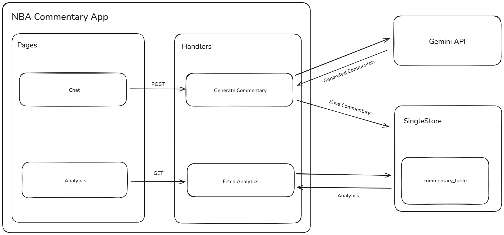

# NBA 2016 Finals Game 7 Analysis

An AI-powered app to generate comments and statistics about the NBA 2016 Finals Game 7 using Drizzle ORM and SingleStore.


## Architecture



## Features

- Generate insightful comments on the game using an AI agent
- Provide detailed statistics and analysis based on the video clip
- Utilize Drizzle ORM for database interactions
- Powered by SingleStore for efficient data handling

## Installation

1. Clone the repository:

   ```bash
   git clone git@github.com:singlestore-labs/nba-AI-drizzle-app-demo.git
   ```

2. Navigate to the app directory:

   ```bash
   cd nba-AI-drizzle-app-demo/app
   ```

## Setup

1. Copy the `default.env` file and name it `.env`:

   ```bash
   cp default.env .env
   ```

2. Get the `DATABASE_URL` from [SingleStore Portal](https://portal.singlestore.com) (Create New > Starter Workspace, and then Connect > Your App > Connection string) and add it to your `.env` file:

   ```env
   DATABASE_URL=singlestore://<user>:<password>@<host>:<port>/<database>?ssl={}
   ```

3. Create the `commentary_table` in the SingleStore database using Drizzle

   ```shell
   pnpm migrate
   ```

4. Get the Gemini API key from [Google Gemini API Documentation](https://ai.google.dev/gemini-api/docs/api-key) and add it to your `.env` file:

   ```env
   GEMINI_API_KEY=your_gemini_api_key
   ```

## Usage

1. Go to the project directory:

   ```bash
   cd ..
   ```

2. Start the application:
   ```bash
   docker compose up --build
   ```
3. Open your browser and navigate to [http://localhost:3001](http://localhost:3001)

## Milestones

1. Setup the repository and run the app
2. The comments are a bit lame; fix them! Search for `TODO(milestone2)`
3. The analytics we're showing are mocked-up; fetch them from the DB! Search for `TODO(milestone3)`
