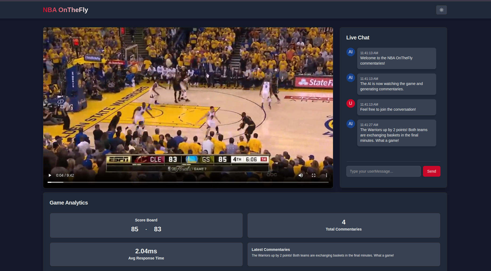

# NBA 2016 Finals Game 7 Analysis

An AI-powered app to generate comments and statistics about the NBA 2016 Finals Game 7 using Drizzle ORM and SingleStore.



## Architecture


## Features

- Generate insightful comments on the game using an AI agent
- Provide detailed statistics and analysis based on the video clip
- Utilize Drizzle ORM for database interactions
- Powered by SingleStore for efficient data handling

## Installation

1. Clone the repository:

   ```bash
   git clone https://github.com/singlestore-labs/nba-AI-drizzle-app-demo.git
   ```

2. Navigate to the repository:

   ```bash
   cd nba-AI-drizzle-app-demo
   ```

## Setup

1. Copy the `default.env` file and name it `.env`:

   ```bash
   cp default.env .env
   ```

2. Get the `DATABASE_URL` from [SingleStore Portal](https://portal.singlestore.com). If you are creating a new account, when prompted to _Load Data_, choose instead _Explore on my own_. Then go to _Deployments_ (on the left sidebar) > _Connect_ > _Your App_ and pick language `Node.js + Drizzle` in the dropdown. Then, copy the connection string and add it to your`.env` file:

   ```env
   DATABASE_URL=singlestore://<user>:<password>@<host>:<port>/<database>?ssl={}
   ```

(Note: if your connection string has a placeholder in the password field, press _Reset Password_, accept the suggested password, and you can now copy the connection string with the password).

3. Get the Gemini API key from [Google Gemini API Documentation](https://ai.google.dev/gemini-api/docs/api-key) and add it to your `.env` file:

   ```env
   GEMINI_API_KEY=your_gemini_api_key
   ```

## Usage

1. Start the application:
   ```bash
   docker compose up --build
   ```
2. Open your browser and navigate to [http://localhost:3001](http://localhost:3001)

## Milestones

1. Setup the repository and run the app
2. The comments are a bit lame; fix them! Search for `TODO(milestone2)`
3. The analytics we're showing are mocked-up; fetch them from the DB! Search for `TODO(milestone3)`
